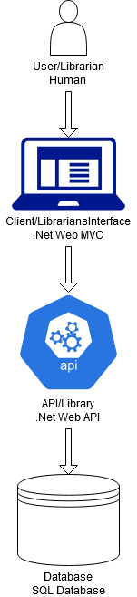

# Library


## Kom igång

- Ladda ned repot från github.
- Öppna solution-filen i visual studio 2019.
- Se till att att korrekt sql-server är vald och att [anslutningssträngen](#Konfigurering-av-applikation) är korrekt utformad.
- Kör programmet.


## Komponenter
- Programmet är skrivet i språket C# och i ASP.NET CORE 3.1.  
- Koppling till SQL-databas med hjälp av Entity Framework Core v3.1.10.
- Detta program har följande NuGet-paket installerade:
  - Microsoft.EntityFrameworkCore v3.1.10
  - Microsoft.AspNetCore.Mvc.NewtonsoftJson v3.1.10
  - Microsoft.EntityFrameworkCore.Design v3.1.10
  - Microsoft.EntityFrameworkCore.Sqlite v3.1.10
  - Microsoft.EntityFrameworkCore.SqlServer v3.1.10
  - Microsoft.VisualStudio.Web.CodeGeneration.Design v3.1.4
- Modell-klasser för att hantera data över många tabeller i databasen.
- Kontroller för att sköta indata och utdata med json.
- programmet är en del av en större arkitektur. Detta är API-delen:



##  För en applikation i produktion

 

### Driftmiljöer för denna applikation

Detta program är färdigt för test-/utvecklingsmiljöer, men koden behöver justeras för produktionssättning. Med Konfigurering (se nästa punkt) och uppladdning till relevant server kan programmet släppas.

### Konfigurering av applikation

Sql-servern och själva databasen behöver ankopplas: I filen filen **appsettings.json** finns i kodblocket och kan se ut såhär:
```
    "ConnectionStrings": 
        { "DefaultConnection": "Data Source=LASERLAPTOP; Database=library;           Trusted_Connection=true; User id=library; Password=KnowledgeIsPower"
        }
```
 Ändra den strängen till den sträng som kommer att användas i vidare testning och sedan produktion. 

---

URL för programmet, samt profiler finns i filen **launchSettings.json** och kan se ut såhär:
```
{
  "$schema": "http://json.schemastore.org/launchsettings.json",
  "iisSettings": {
    "windowsAuthentication": false,
    "anonymousAuthentication": true,
    "iisExpress": {
      "applicationUrl": "http://localhost:65144",
      "sslPort": 44303
    }
  },
  "profiles": {
    "IIS Express": {
      "commandName": "IISExpress",
      "launchBrowser": true,
      "launchUrl": "api/books",
      "environmentVariables": {
        "ASPNETCORE_ENVIRONMENT": "Development"
      }
    },
    "Library": {
      "commandName": "Project",
      "launchBrowser": true,
      "launchUrl": "api/books",
      "applicationUrl": "https://localhost:5001;http://localhost:5000",
      "environmentVariables": {
        "ASPNETCORE_ENVIRONMENT": "Development"
      }
    }
  }
}

```

---
För test av program med en förpopulerad databas finns en fil som heter DbInitializer.cs. Den kommer att seeda databasen om den är tom. Den bör dock inte användas när projektet produktionssätts.

    